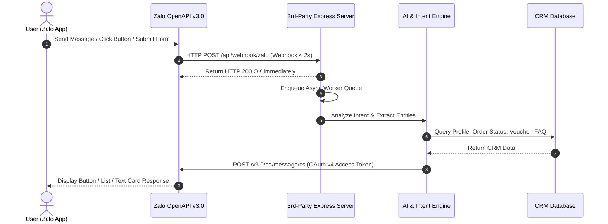

# 🚀 Zalo 3rd-Party Integration Simulator & AI CRM Hub

> **A Complete Simulator & Integration Engine for Zalo Official Account (OA) v3.0 with 3rd-Party CRM / ERP & AI Engine**  
> Compliant with the **Zalo Developers Hub (2026 Latest Specs)**: OAuth v4 with PKCE, OpenAPI v3.0, Webhook HTTPS < 2s response rules, ZBS Template Messages, and Realtime Visual Pipeline Inspector.

---

## 🌟 Key Features

### 📱 1. Interactive Zalo Phone Simulator
- **Action Buttons & Quick Replies**: Full support for interactive action buttons (`oa.query.show`, `oa.open.url`, `oa.open.phone`).
- **Zalo Form Submit Modal**: Users can input Full Name, Phone Number, and Shipping Address directly within the Zalo interface $\rightarrow$ posted to the 3rd-party backend via Webhooks.
- **Card Templates & Carousels**: Send rich list cards for product catalogs, Google Maps directions, and emergency hotline call triggers.

### ⚡ 2. Realtime Visual Pipeline Inspector (SSE Stream)
- Visualize **100% of the live data pipeline** via Server-Sent Events (SSE):
  1. 📩 `WEBHOOK_RECEIVED` — Ingest Webhook HTTP POST from Zalo OA (< 2-second SLA).
  2. 📥 `QUEUE_ENQUEUED` — Push message to the Async Processing Queue with exponential retry policies.
  3. 🧠 `AI_ANALYSIS` — Extract Intent, Context Entities, Sentiment, and Confidence Scores.
  4. 🗄️ `CRM_LOOKUP` — Query customer CRM records (Order status, Member tier, Vouchers).
  5. 📤 `ZALO_SEND_API` — Dispatch response payload via Zalo OpenAPI v3.0.
  6. 🔑 `TOKEN_REFRESH` — Auto-refresh OAuth v4 Access Token.

### 🔑 3. Zalo OAuth v4 & OpenAPI v3.0 Specs
- **OAuth v4 with PKCE**: Automatic lifecycle management for **Access Token (25-hour expiration)** and **Refresh Token (3-month expiration)**.
- **Dual Operational Modes**:
  - `⚡ Mock Offline Mode`: For local development, UI testing, and scenario building without requiring live Zalo credentials.
  - `🚀 Production Mode`: Connect directly with Zalo Developers App ID, App Secret & Zalo Cloud Account (ZCA).
- **HMAC-SHA256 Verification Code**: Built-in reference middleware for verifying `x-zalo-signature` request integrity.

### 🤖 4. AI Engine & CRM Knowledge Base
- **Automated Intent Recognition**:
  - `GET_USER_PROFILE_API`: Retrieve customer profile & VIP membership tier from CRM.
  - `SUBMIT_FORM_DATA_API`: Handle Zalo Form submissions and issue confirmation Ticket IDs.
  - `ORDER_INQUIRY`: Track shipment & order status (`#8899`, `#12345`, `#9922`).
  - `VERIFY_VOUCHER_API`: Validate promotional coupon codes (`ZALO50K`, `VIP2026`).
  - `GET_LOCATION_INFO_API`: Return warehouse coordinates & Google Maps action buttons.
  - `HUMAN_HANDOVER_REQUIRED`: Detect negative sentiment and trigger agent handover protocols.
- **CRM Knowledge Base Tab**: Interactive dashboard tab to edit FAQ entries and CRM mock datasets in real-time.

---

## 🛠️ Tech Stack

- **Frontend**: React 18, Vite, Tailwind CSS, Lucide React Icons.
- **Backend**: Node.js, Express.js, Server-Sent Events (SSE).
- **Tooling & Testing**: Concurrently, Native HTTP E2E Pipeline Tester (`scripts/test_pipeline.js`).

---

## 🏗️ Architecture Overview



---

## 🚀 Getting Started

### 1. Prerequisites
- **Node.js**: `v18.0.0` or higher.
- **npm**: `v9.0.0` or higher.

### 2. Installation
```bash
# Clone the repository
git clone git@github.com:chungkio/zalo-3rd-party-integration-simulator.git
cd zalo-3rd-party-integration-simulator

# Install dependencies
npm install
```

### 3. Running in Development Mode
This command concurrently starts the **Backend Express Server (Port 3001)** and **Frontend Vite App (Port 5173)**:
```bash
npm run dev
```

Once running:
- **Frontend App**: Open `http://localhost:5173`
- **Backend API**: Open `http://localhost:3001`

### 4. Running Automated Integration Tests
Open a separate terminal window and execute the automated E2E test suite for Interactive Buttons & Form Submissions:
```bash
node scripts/test_pipeline.js
```

---

## 📂 Project Structure

```text
zalo-3rd-party-integration-simulator/
├── scripts/
│   └── test_pipeline.js        # Automated E2E integration test suite
├── server/
│   ├── index.js                # Express Server, SSE Stream & Webhook Endpoints
│   └── services/
│       ├── aiEngine.js         # AI Intent Analysis, Sentiment & Zalo Payloads
│       ├── zaloTokenManager.js # OAuth v4 Access & Refresh Token Management
│       └── mockCrmDb.js        # Re-export mock CRM database
├── src/
│   ├── components/
│   │   ├── ZaloPhoneSimulator.jsx  # Zalo Phone UI Chat & Form Submission Modal
│   │   ├── PipelineInspector.jsx   # Visual Realtime SSE Pipeline Stream
│   │   ├── TokenAndConfigModal.jsx # Zalo OAuth Credentials & v3.0 Guide
│   │   ├── CrmKnowledgeBase.jsx    # Interactive CRM & FAQ Management UI
│   │   └── ErrorBoundary.jsx       # React Error Boundary Wrapper
│   ├── data/
│   ├── App.jsx                 # Main 2-Column Dashboard Layout
│   ├── main.jsx
│   └── index.css               # Styling & Tailwind CSS Setup
├── package.json
├── tailwind.config.js
├── vite.config.js
└── README.md
```

---

## 📜 License

Distributed under the **MIT License**. Feel free to customize and integrate this simulator into your enterprise workflows.
