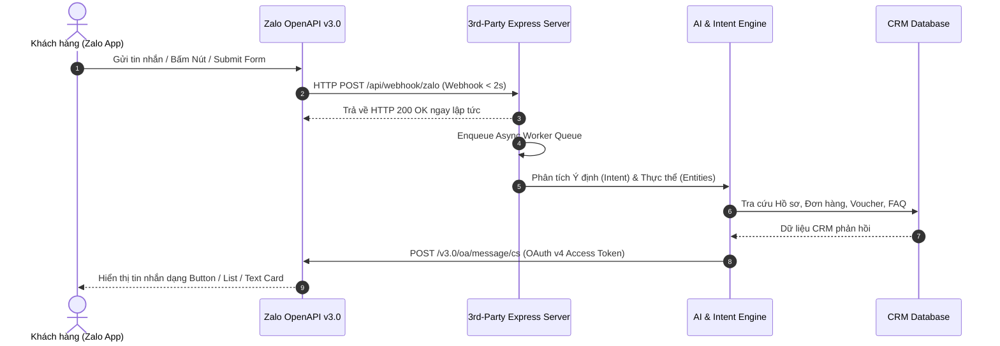

# 🚀 Zalo 3rd-Party Integration Simulator & AI CRM Hub

> **Hệ thống Mô phỏng & Tích hợp Zalo Official Account (OA) v3.0 với CRM / ERP & AI Engine bên thứ 3**  
> Đáp ứng đầy đủ quy chuẩn **Zalo Developers Hub (Mới nhất 2026)**: OAuth v4 với PKCE, OpenAPI v3.0, Webhook HTTPS < 2s, ZBS Template Message & Realtime Visual Inspector.

---

## 🌟 Tính Năng Nổi Bật (Key Features)

### 📱 1. Giả Lập Giao Diện Điện Thoại Zalo (Phone Simulator)
- **Interactive Buttons & Quick Replies**: Mô phỏng đầy đủ các nút bấm hành động (`oa.query.show`, `oa.open.url`, `oa.open.phone`).
- **Zalo Form Submit Modal**: Khách hàng nhập Họ tên, SĐT, Địa chỉ directly trên giao diện Zalo $\rightarrow$ đẩy trực tiếp về Backend 3rd-party qua Webhook.
- **Card Templates & Carousel**: Gửi tin nhắn dạng danh sách sản phẩm (List Card), nút chỉ đường Google Maps & gọi Hotline khẩn cấp.

### ⚡ 2. Visual Pipeline Inspector (Realtime SSE Stream)
- Trực quan hóa **100% luồng đi của dữ liệu trong thời gian thực** (Realtime Server-Sent Events):
  1. 📩 `WEBHOOK_RECEIVED` — Tiếp nhận Webhook HTTP POST từ Zalo OA (< 2 giây).
  2. 📥 `QUEUE_ENQUEUED` — Đưa tin nhắn vào Hàng chờ xử lý bất đồng bộ (Async Queue & Retry Policy).
  3. 🧠 `AI_ANALYSIS` — Phân tích Ý định (Intent), Bối cảnh (Entities), Cảm xúc (Sentiment) & Điểm tin cậy (Confidence).
  4. 🗄️ `CRM_LOOKUP` — Truy xuất cơ sở dữ liệu CRM khách hàng (Đơn hàng, Thẻ hội viên, Voucher).
  5. 📤 `ZALO_SEND_API` — Gọi Zalo OpenAPI v3.0 gửi tin nhắn phản hồi đến người dùng.
  6. 🔑 `TOKEN_REFRESH` — Tự động làm mới OAuth v4 Access Token.

### 🔑 3. Quản Lý Zalo OAuth v4 & OpenAPI v3.0 Specs
- **Cơ chế OAuth v4 với PKCE**: Tự động quản lý **Access Token (hạn 25 giờ)** và **Refresh Token (hạn 3 tháng)**.
- **Chế độ Chuyển đổi linh hoạt**:
  - `⚡ Mock Offline Mode`: Dùng để lập trình, test UI & chạy kịch bản không cần Zalo thật.
  - `🚀 Production Mode`: Kết nối trực tiếp với Zalo Developers App ID, App Secret & Zalo Cloud Account (ZCA).
- **Code Mẫu Xác thực HMAC-SHA256**: Đi kèm code mẫu kiểm tra chữ ký `x-zalo-signature` cho Webhook.

### 🤖 4. AI Engine & CRM Knowledge Base
- **Nhận diện Ý định tự động (Intent Recognition)**:
  - `GET_USER_PROFILE_API`: Tra cứu thông tin hồ sơ & hạng thẻ VIP từ CRM.
  - `SUBMIT_FORM_DATA_API`: Tiếp nhận form đăng ký khách hàng & khởi tạo Ticket ID.
  - `ORDER_INQUIRY`: Tra cứu đơn hàng (`#8899`, `#12345`, `#9922`) & mã vận đơn.
  - `VERIFY_VOUCHER_API`: Xác thực mã giảm giá (`ZALO50K`, `VIP2026`).
  - `GET_LOCATION_INFO_API`: Trả về tọa độ kho tổng & nút mở Google Maps.
  - `HUMAN_HANDOVER_REQUIRED`: Tự động nhận diện thái độ tiêu cực và kích hoạt kịch bản chuyển Chăm sóc viên.
- **CRM Knowledge Base Tab**: Giao diện trực quan cho phép chỉnh sửa cơ sở kiến thức FAQ & dữ liệu mẫu.

---

## 🛠️ Công Nghệ Sử Dụng (Tech Stack)

- **Frontend**: React 18, Vite, Tailwind CSS, Lucide React Icons.
- **Backend**: Node.js, Express.js, Server-Sent Events (SSE).
- **Tooling & Test**: Concurrently, Native HTTP E2E Pipeline Tester (`scripts/test_pipeline.js`).

---

## 🏗️ Kiến Trúc Hệ Thống (Architecture Overview)



---

## 🚀 Hướng Dẫn Cài Đặt & Chạy Dự Án (Getting Started)

### 1. Yêu cầu hệ thống
- **Node.js**: `v18.0.0` trở lên.
- **npm**: `v9.0.0` trở lên.

### 2. Cài đặt Dependencies
```bash
# Clone repository
git clone git@github.com:chungkio/zalo-3rd-party-integration-simulator.git
cd zalo-3rd-party-integration-simulator

# Cài đặt thư viện
npm install
```

### 3. Chạy môi trường Phát triển (Dev Mode)
Lệnh này sẽ chạy song song cả **Backend Node.js Server (Port 3001)** và **Frontend Vite (Port 5173)**:
```bash
npm run dev
```

Sau khi chạy thành công:
- **Frontend App**: Truy cập `http://localhost:5173`
- **Backend API**: Truy cập `http://localhost:3001`

### 4. Chạy Bộ Test Tự Động (Automated Integration Tests)
Mở một terminal mới và chạy bộ test E2E cho toàn bộ kịch bản Interactive Buttons & Form Submit:
```bash
node scripts/test_pipeline.js
```

---

## 📂 Cấu Trúc Thư Mục (Project Structure)

```text
zalo-3rd-party-integration-simulator/
├── scripts/
│   └── test_pipeline.js        # Script chạy bộ test tự động E2E
├── server/
│   ├── index.js                # Express Server, SSE Stream & Webhook Endpoints
│   └── services/
│       ├── aiEngine.js         # Phân tích AI Intent, Sentiment & Zalo Payloads
│       ├── zaloTokenManager.js # Quản lý OAuth v4 Access Token & Refresh Token
│       └── mockCrmDb.js        # Re-export mock database
├── src/
│   ├── components/
│   │   ├── ZaloPhoneSimulator.jsx  # Mô phỏng UI Điện thoại Zalo Chat & Form Modal
│   │   ├── PipelineInspector.jsx   # Visual Realtime Log Stream (SSE)
│   │   ├── TokenAndConfigModal.jsx # Quản lý Zalo Credentials & Hướng dẫn v3.0
│   │   ├── CrmKnowledgeBase.jsx    # Giao diện quản lý CRM Database & FAQ
│   │   └── ErrorBoundary.jsx       # Error Boundary bọc ứng dụng React
│   ├── data/
│   ├── App.jsx                 # Layout chính dạng Dashboard 2 cột
│   ├── main.jsx
│   └── index.css               # Styling & Tailwind CSS setup
├── package.json
├── tailwind.config.js
├── vite.config.js
└── README.md
```

---

## 📜 Giấy Phép (License)

Dự án phát triển mã nguồn mở theo giấy phép **MIT License**. Bạn có thể tự do sử dụng và tích hợp vào hệ thống doanh nghiệp của mình.
